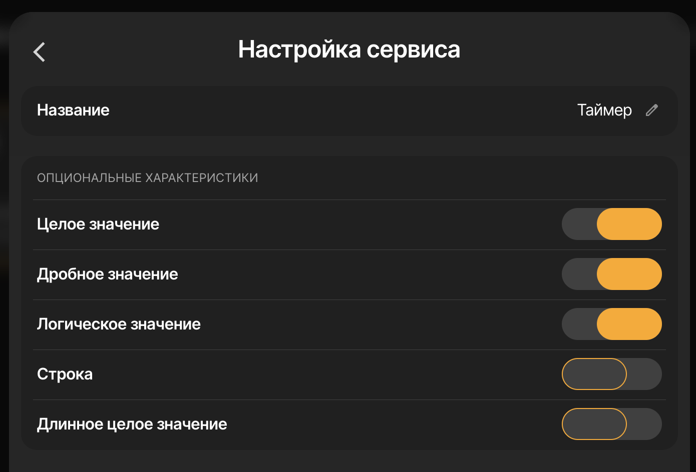
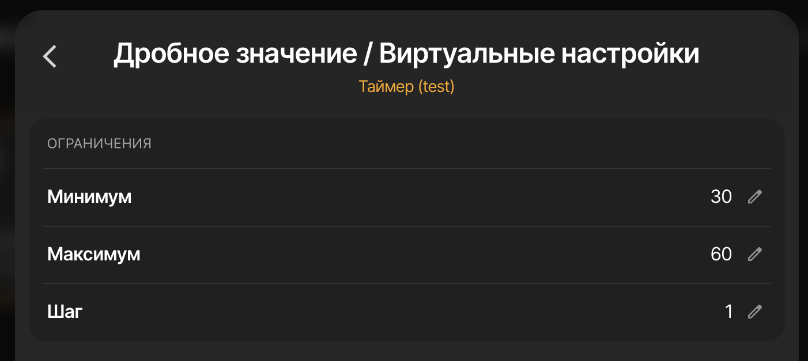
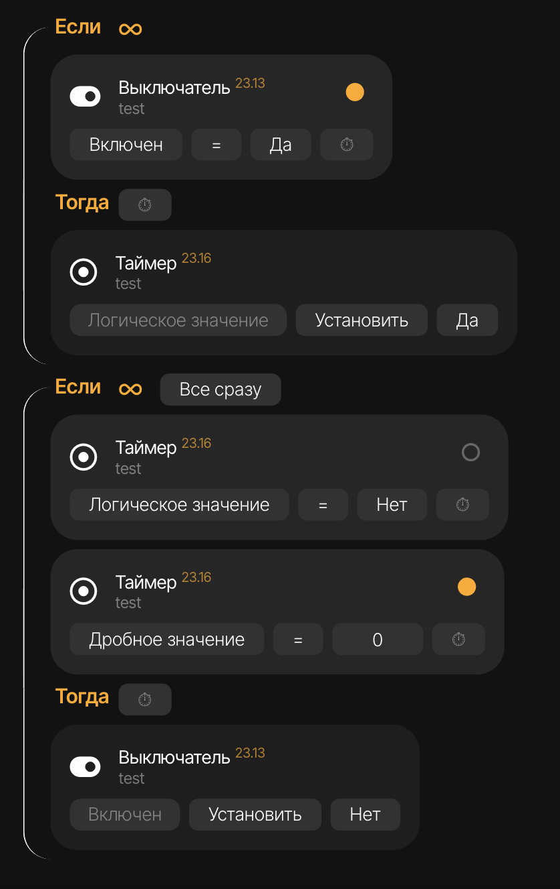

# ⏰ Параметр-Таймер

> **Настраиваемая задержка с удобным управлением через интерфейс**

Логический сценарий для Sprut.Hub, который позволяет создавать гибкие задержки в автоматизациях. В отличие от обычной задержки, время можно легко менять прямо из интерфейса приложения, не редактируя сценарий.

---

## 💡 Зачем это нужно?

**Проблема:** В стандартных сценариях задержка задаётся жёстко в коде. Чтобы изменить время, нужно каждый раз редактировать сценарий.

**Решение:** Параметр-Таймер создаёт устройство с ползунком, где вы можете выставить нужное время. Просто передвигаете ползунок — и задержка изменилась!

---

## 🎯 Как это работает?

1. **Устанавливаете время** — выбираете сколько секунд должен работать таймер
2. **Запускаете таймер** — включаете переключатель
3. **Идёт обратный отсчёт** — таймер показывает оставшееся время
4. **Таймер завершается** — переключатель автоматически выключается
5. **Сценарий срабатывает** — выполняется нужное действие

---

## 📋 Пошаговая инструкция

### Шаг 1: Создание виртуального устройства

Создайте виртуальное устройство типа **"Параметр"** с тремя характеристиками:



**Обязательные характеристики:**
- ✅ **Логическое значение** (C_Boolean) — переключатель для запуска/остановки таймера
- ✅ **Целое значение** (C_Integer) — отображает обратный отсчёт в секундах
- ✅ **Дробное значение** (C_Double) — задаёт время таймера (можно указывать дробные секунды)

### Шаг 2: Применение логического сценария

1. Откройте настройки созданного устройства
2. Перейдите в раздел **"Логические сценарии"**
3. Примените сценарий **"⏰ Параметр-Таймер"**

### Шаг 3: Настройка параметров времени

Настройте удобные границы для установки времени:



В настройках **"Виртуальное устройство"** → **"Дробное значение"** установите:
- **Минимум**: 30 (минимальное время в секундах)
- **Максимум**: 60 (максимальное время в секундах)  
- **Шаг**: 1 (с каким шагом изменяется время)

> 💡 **Совет:** Эти настройки позволят удобно выбирать время ползунком в приложении

### Шаг 4: Создание блочного сценария

Создайте блочный сценарий, который будет выполнять действие после завершения таймера:



**Структура сценария:**

1. **Первый блок — Запуск таймера:**
   ```
   ЕСЛИ: (нужное условие для запуска)
   ТОГДА: Установить "Логическое значение" таймера = Да
   ```

2. **Второй блок — Действие после таймера:**
   ```
   ЕСЛИ (Всё сразу):
     • Целое значение = 0 (триггер)
     • Логическое значение = Нет (убрать лишние срабатывания)
   ТОГДА: 
     • (ваше действие, которое выполнится через N секунд)
   ```

> ⚠️ **Важно:** Условие "Логическое значение = Нет" обязательно! Без него сценарий будет срабатывать при каждом обновлении значения.

---

## ⚙️ Опции сценария

### Показывать обратный отсчёт в имени устройства

Если включить эту опцию, имя устройства будет показывать оставшееся время:

- **Таймер выключен:** "Таймер лампочки"
- **Таймер активен:** "10 - Таймер лампочки" → "9 - Таймер лампочки" → "8 - Таймер лампочки" → ...
- **Таймер завершён:** "Таймер лампочки"

Это удобно для быстрого контроля состояния таймера прямо из списка устройств.

---

## 🎬 Примеры использования

### 1. Таймер освещения в коридоре

**Задача:** Свет в коридоре должен включаться по датчику движения и автоматически выключаться через 30 секунд.

**Решение:**
1. Установите время таймера: **30 секунд**
2. Первый сценарий: *Датчик движения сработал* → Включить свет + Запустить таймер
3. Второй сценарий: *Таймер завершился (целое = 0)* → Выключить свет

**Преимущество:** Можно легко изменить время (например, до 60 секунд), не редактируя сценарий

### 2. Автоматическое проветривание

**Задача:** Открыть окно на проветривание на 15 минут, затем автоматически закрыть.

**Решение:**
1. Установите время таймера: **900 секунд** (15 минут)
2. Запустите таймер кнопкой или голосовой командой
3. Окно откроется, таймер пойдёт
4. Через 15 минут окно автоматически закроется

### 3. Ограничение времени работы обогревателя

**Задача:** Обогреватель не должен работать больше 2 часов подряд для безопасности.

**Решение:**
1. Установите время таймера: **7200 секунд** (2 часа)
2. При включении обогревателя автоматически запускается таймер
3. Через 2 часа обогреватель автоматически выключится

---

## 🔧 Особенности работы

### Поддержка дробных секунд

Таймер поддерживает дробные значения для точных задержек:
- **1.5** секунды = 1 секунда 500 миллисекунд
- **0.5** секунды = 500 миллисекунд
- **5.3** секунды = 5 секунд 300 миллисекунд

> 💡 Это полезно для быстрых импульсов в автоматизациях (например, кратковременное включение реле)

### Что происходит внутри

1. **При изменении времени** — значение автоматически дублируется в "Целое значение" (для отображения)
2. **При запуске** — каждую секунду "Целое значение" уменьшается на 1
3. **При завершении** — "Логическое значение" выключается, исходные значения восстанавливаются через 1 секунду
4. **При остановке** — таймер сбрасывается, возвращаются исходные значения

### Ограничения

- ⏱️ Максимальное время таймера: **24 часа** (86400 секунд)
- ⏱️ Минимальное время: **больше 0** (нельзя запустить с нулевым или отрицательным значением)

---

## 📦 Установка

### Требования

- Sprut.Hub с поддержкой логических сценариев
- Версия прошивки поддерживающая виртуальные устройства

### Шаги установки

1. Скачайте файл `Timer.js` из папки `source/`
2. Импортируйте сценарий через интерфейс Sprut.Hub:
   - Настройки → Логические сценарии → Добавить
3. Создайте виртуальное устройство согласно инструкции выше

---

## 🐛 Решение проблем

**Таймер не запускается**
- Проверьте, что время больше 0
- Убедитесь, что все 3 характеристики добавлены в устройство

**Сценарий срабатывает несколько раз**
- Добавьте условие "Логическое значение = Нет" в блок "Если"

**Обратный отсчёт не отображается**
- Проверьте, что характеристика "Целое значение" (C_Integer) добавлена

---

## 📝 Версия и автор

- **Версия:** 1.0
- **Автор:** @BOOMikru
- **Лицензия:** MIT

---

## 🙏 Поддержка проекта

Если этот сценарий оказался полезен, поставьте ⭐ на GitHub!

Нашли ошибку или есть идея по улучшению? Создайте Issue или Pull Request.
