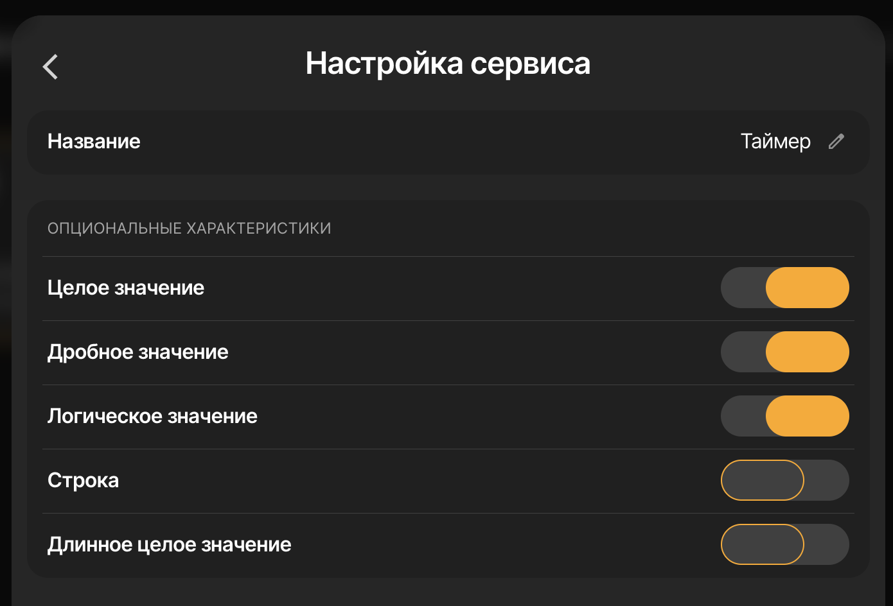
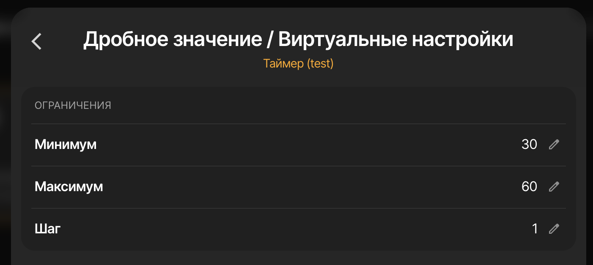
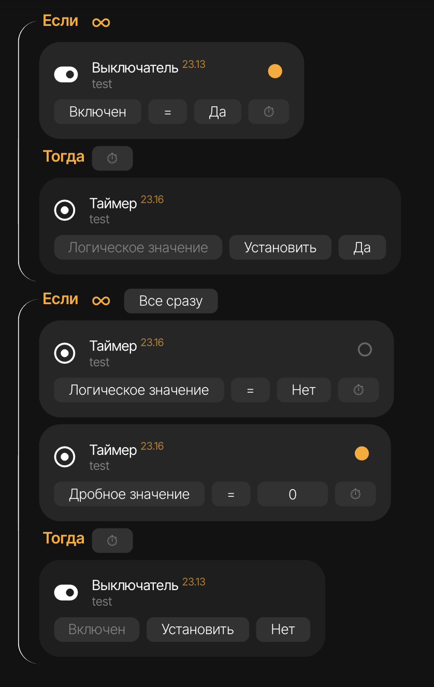
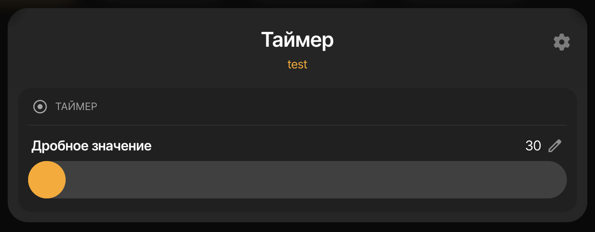

# ⏰ Параметр-Таймер
Логический сценарий

> **Настраиваемая задержка с удобным управлением через интерфейс**

Логический сценарий для Sprut.Hub, который позволяет создавать гибкие задержки в автоматизациях. В отличие от обычной задержки, время можно легко менять прямо из интерфейса приложения, не редактируя сценарий.

---

## 💡 Зачем это нужно?

**Проблема:** В стандартных сценариях задержка задаётся жёстко в блоке. Чтобы изменить время, нужно каждый раз редактировать сценарий.

**Решение:** Параметр-Таймер создаёт устройство с ползунком, где вы можете выставить нужное время. Просто передвигаете ползунок — и задержка изменилась!

---

## 🎯 Как это работает?

1. **Устанавливаете время** — выбираете сколько секунд должен работать таймер
2. **Запускаете таймер** — включаете переключатель
3. **Идёт обратный отсчёт** — таймер показывает оставшееся время
4. **Таймер завершается** — переключатель автоматически выключается
5. **Сценарий срабатывает** — выполняется нужное действие

---

## 📋 Пошаговая инструкция

### Шаг 1: Создание виртуального устройства

Создайте виртуальное устройство типа **"Параметр"** с тремя характеристиками:



**Обязательные характеристики:**
- ✅ **Логическое значение** (C_Boolean) — переключатель для запуска/остановки таймера
- ✅ **Целое значение** (C_Integer) — отображает обратный отсчёт в секундах
- ✅ **Дробное значение** (C_Double) — задаёт время таймера (можно указывать дробные секунды)

### Шаг 2: Применение логического сценария

1. Скачайте файл `Timer.json` из папки сценарий
2. Импортируйте сценарий через интерфейс Sprut.Hub:
   - Сценарии → Логические → + → Импортировать шаблон  → выберите скачанный файл.
3. Откройте настройки созданного на шаге выше устройства
4. Перейдите в раздел **"Логика"**
5. Выберите сценарий **"⏰ Параметр-Таймер"**
6. Если надо, включите опцию "Менять имя сервиса"
7. Активируйте сценарий переключателем "Активно"


### Опция "Менять имя сервиса"

Если включить эту опцию, имя устройства будет показывать оставшееся время:

- **Таймер выключен:** "Таймер лампочки"
- **Таймер активен:** "10 - Таймер лампочки" → "9 - Таймер лампочки" → "8 - Таймер лампочки" → ...
- **Таймер завершён:** "Таймер лампочки"

Это удобно для быстрого контроля состояния таймера прямо из списка устройств.

---

### Шаг 3: Настройка параметров времени

Настройте удобные границы для установки времени:



В настройках **"Виртуальное устройство"** → **"Дробное значение"** установите желаемые диапазоны изменения задержки, например:
- **Минимум**: 30 (минимальное время в секундах)
- **Максимум**: 60 (максимальное время в секундах)  
- **Шаг**: 1 (с каким шагом изменяется время)

> 💡 **Совет:** Эти настройки позволят удобно выбирать время ползунком в интерфейсе

### Шаг 4: Создание блочного сценария

Создайте блочный сценарий, который будет запускать задержку и выполнять действие после завершения таймера:



**Структура сценария:**

1. **Первый блок — Запуск таймера:**
   ```
   ЕСЛИ: (нужное условие для запуска)
   ТОГДА:"Логическое значение" таймера Установить Да
   ```

2. **Второй блок — Действие после таймера:**
   ```
   ЕСЛИ (Всё сразу):
     • Целое значение = 0 (триггер)
     • Логическое значение = Нет (убрать триггер)
   ТОГДА: 
     • (ваше действие, которое выполнится через N секунд)
   ```

### Шаг 5: Настройка видимости характеристик.
После установки можно скрыть с экрана устройства лашние поля, оставив только Дробное значения для задания длительности задержки.



Для этого зайдите в Настройки устройства - Экран управления (в блоке Видимость) и отключите всё, кроме "Дробное значение".

---

## 🎬 Примеры использования

### 1. Отладка

**Задача:** Отладка времени задержки для сценариев. Если не понятно какую задержку поставить для корректной работы, например света по датчику движения

**Решение:**
Используйте данный сценарий. Если значение задержки не подходит - легко измените его на экране, не заходя в сценарий

**Преимущество:** Можно легко изменить время (например, до 60 секунд), не редактируя сценарий

### 2. Автоматическое проветривание

**Задача:** Открывать окно на проветривание на 15 минут летом, а зимой на 5 минут.

**Решение:**
Используйте Параметр-таймер для задержки открытия окна. И дополнительным сценарием в зависимости от времени года меняется время задержки.

### 3. Контроль задержек пользователем

**Задача:** Позволить пользователю самому редактировать задержки, что бы не приходилось заходить в сценарий

**Решение:**
Вы, как интегратор или настройщик умного дома используете данный сценарий, создаёте отдельные устройства для задержек и позволяете пользователю гибко настраивать поведение дома.
